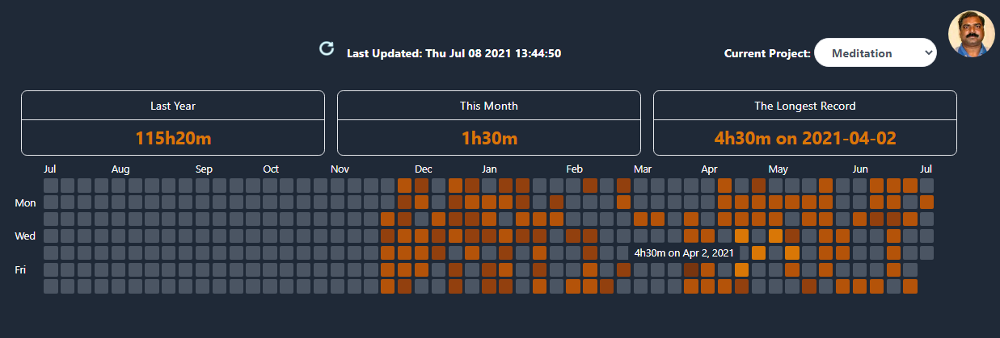

# Habit Tracker

* [System requirements](#system-requirements)
* [Installing for dev](#installing-for-dev)
* [License](#license)

## System requirements
* Nodejs 12.0+

## Installing for dev
* cp .env.example .env
* fill the connection info of env file
* npm install
* Create new mysql user and database
* npm run init
* npm run start
* open the page http://127.0.0.1:3000/, and log in using jjj/passowrd

* (If you are using vm or access from the other domain, please put your domain name into SANCTUM_STATEFUL_DOMAINS in the .env, or you won't able to pass the authentication)

<!-- ABOUT THE PROJECT -->
## About The Project

> If you want to stick with a habit for good, one simple and effective thing you can do is keep a habit tracker. (James Clear, "Atomic Habits")

* Fetch the record from Toggl and insert into DB.
* A github-like activity board to diplay daily summary.

### Built With

* [NestJS](https://github.com/nestjs/nest)
* [VueJS 2](https://vuejs.org/)
* [Tailwind CSS](https://tailwindcss.com/)
* [Swagger](https://swagger.io/solutions/api-documentation/)

<!-- LICENSE -->
## License

Distributed under the MIT License. See `LICENSE` for more information.
